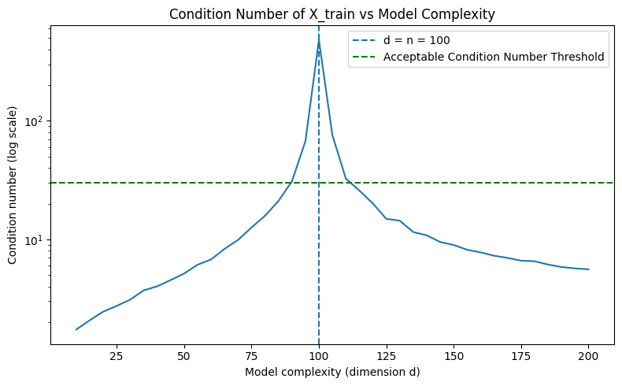
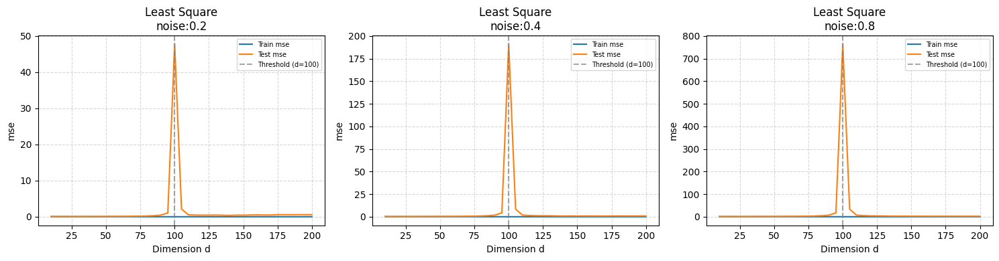
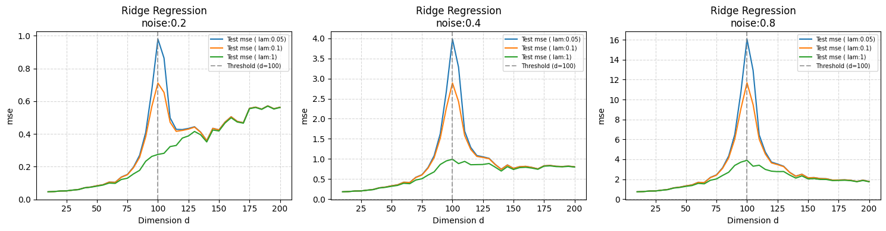
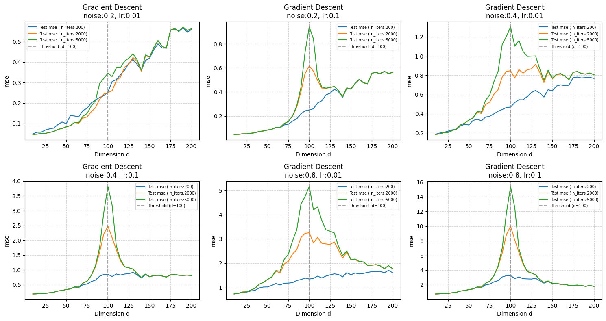

<div align="center">

# 📉 Double Descent in Linear Regression

### Empirical reproduction of the double descent phenomenon — from scratch, in pure NumPy

[](https://www.python.org/)
[](https://numpy.org/)
[](https://matplotlib.org/)
[](LICENSE)

<br/>

> *"More parameters can be better."*
> — Belkin et al., PNAS 2019

<br/>

This project challenges the classical **bias-variance U-curve** by empirically demonstrating the **double descent** phenomenon: the surprising finding that test error spikes catastrophically at the interpolation threshold $d = n$, then descends again as the model becomes increasingly over-parameterised.

Three learning algorithms are implemented **entirely from scratch**, with no ML libraries — only NumPy arrays and linear algebra.

</div>

---

## 🔭 Results at a Glance

<table>
<tr>
<td width="50%" align="center">

**Condition Number vs. Model Complexity**

The condition number of $X_{\text{train}}$ explodes at $d = n$, revealing the numerical root of the catastrophic peak.



</td>
<td width="50%" align="center">

**Ordinary Least Squares — Double Descent**

Train error (🔵) drops to zero at the threshold. Test error (🟠) spikes, then descends a second time.



</td>
</tr>
<tr>
<td width="50%" align="center">

**Ridge Regression — Taming the Peak**

Explicit $\ell_2$ regularisation ($\lambda \in \{0.05, 0.1, 1\}$) dramatically reduces the interpolation spike.



</td>
<td width="50%" align="center">

**Gradient Descent — Implicit Regularisation**

Early stopping acts as $\ell_2$ regularisation: fewer iterations $\Leftrightarrow$ stronger implicit $\lambda$.



</td>
</tr>
</table>

---

## 📖 Background

Classical statistical learning theory predicts a **U-shaped test error curve**: adding model complexity first helps (bias ↓), then hurts (variance ↑), and the optimal model lives at the trough.

$$\mathbb{E}[(y - \hat{f}(x))^2] = \text{Bias}^2(\hat{f}) + \text{Var}(\hat{f}) + \sigma^2$$

This project shows that picture is **incomplete**. The true curve has three regimes:

| Regime | Condition | What happens |
|---|---|---|
| **Classical** | $d \ll n$ | Familiar U-shape — bias ↓, variance ↑ |
| **Interpolation threshold** | $d \approx n$ | Condition number → ∞, test error **explodes** |
| **Modern / over-parameterised** | $d \gg n$ | Minimum-norm solution generalises — test error **descends again** |

The key insight: in the over-parameterised regime, the pseudoinverse selects the **minimum-norm interpolant**, which is implicitly regularised and often generalises *better* than any under-parameterised model.

---

## 🗂️ Project Structure

```
double-descent/
│
├── 📓 notebook.ipynb          # Main experiment notebook — run this
│
├── 🧮 utils.py                # Everything from scratch
│   ├── ML Models
│   │   ├── fit_least_squares()        # Normal equations + pseudoinverse (SVD)
│   │   ├── fit_ridge_regression()     # (XᵀX + λI)⁻¹ Xᵀy
│   │   └── fit_least_squares_gd()     # Gradient descent, w₀ = 0
│   │
│   └── Linear Algebra Engine
│       ├── row_reduce()               # Gauss-Jordan elimination
│       ├── matrix_rank()              # Via row reduction
│       ├── matrix_inverse()           # Via augmented row reduction
│       ├── pseudoinverse_svd()        # V Σ⁺ Uᵀ
│       ├── svd()                      # Full SVD via eigendecomposition
│       ├── eigenvalue()               # QR algorithm (iterative)
│       ├── qr_decomposition()         # Gram-Schmidt
│       └── vector_norm()              # ‖v‖₂
│
├── 📊 functions.py            # Simulation & plotting framework
│   ├── SyntheticData          # Reproducible data generation
│   └── DDSimulation           # Grid-search runner + all plots
│
└── 📄 report/
    ├── double_descent_report.pdf    # Full compiled report
    └── double_descent_report.tex    # LaTeX source
```

---

## ⚡ Quick Start

### Prerequisites

```bash
pip install numpy matplotlib
```

### Run the full experiment

```python
import numpy as np
from functions import DDSimulation

n_train    = 100
n_test     = 1000
dim_values = np.arange(10, 201, 5)   # sweep d from 10 to 200

# ── Least Squares ──────────────────────────────────────────────
sim = DDSimulation(
    model        = 'ls',
    n_train      = n_train,
    n_test       = n_test,
    dim_values   = dim_values,
    seed_values  = np.arange(1, 3),
    noise_values = [0.2, 0.4, 0.8],
)
sim.run_simulation()
sim.plot_simulation(metric='mse', train=True)

# ── Ridge Regression ───────────────────────────────────────────
sim_ridge = DDSimulation(
    model              = 'ridge',
    n_train            = n_train,
    n_test             = n_test,
    dim_values         = dim_values,
    seed_values        = np.arange(1, 3),
    noise_values       = [0.2, 0.4, 0.8],
    model_kwargs_values = {'lam': [0.05, 0.1, 1]},
)
sim_ridge.run_simulation()
sim_ridge.plot_simulation(metric='mse', group_attrs=['noise'])

# ── Gradient Descent ───────────────────────────────────────────
sim_gd = DDSimulation(
    model              = 'gd',
    n_train            = n_train,
    n_test             = n_test,
    dim_values         = dim_values,
    seed_values        = np.arange(1, 10),
    noise_values       = [0.5],
    model_kwargs_values = {
        'lr'     : [0.01, 0.1],
        'n_iters': [200, 2000, 5000],
    },
)
sim_gd.run_simulation()
sim_gd.plot_simulation(metric='mse', group_attrs=['noise', 'lr'])
```

---

## 🔬 What's Implemented From Scratch

Every numerical operation — from the ground up. No `scipy`, no `sklearn`.

<summary><b>📐 Linear Algebra Engine</b></summary>

<br/>

| Function | Algorithm | Notes |
|---|---|---|
| `row_reduce(A)` | Gauss-Jordan elimination | Supports augmented matrices for inversion |
| `matrix_rank(A)` | Row reduction → count non-zero rows | Falls back to `np.linalg.matrix_rank` in fast mode |
| `matrix_inverse(A)` | Augmented row reduction `[A | I]` | Raises `ValueError` for singular matrices |
| `qr_decomposition(A)` | Gram-Schmidt orthogonalisation | Used as the inner loop of the QR eigenvalue algorithm |
| `eigenvalue(XᵀX)` | QR algorithm (iterative) | Converges when off-diagonal elements vanish |
| `svd(X)` | Eigendecomposition of $XX^T$ or $X^TX$ | Chooses the smaller Gram matrix based on $n$ vs $d$ |
| `pseudoinverse_svd(X)` | $V \Sigma^+ U^T$ | Handles rank-deficient and non-square matrices |


<summary><b>🤖 Machine Learning Models</b></summary>

<br/>

**Ordinary Least Squares**

$$
\hat{w} =
\begin{cases}
(X^T X)^{-1} X^T y & \text{if } d < n \\
X^T (X X^T)^{-1} y & \text{if } d > n
\end{cases}
$$

Automatically switches to the pseudoinverse when $X^TX$ is singular (i.e., at and beyond the interpolation threshold).

**Ridge Regression**

$$\hat{w}_{\text{ridge}} = (X^TX + \lambda I)^{-1}X^Ty$$

The $\lambda I$ shift guarantees invertibility for any $\lambda > 0$, bounding the condition number and eliminating the catastrophic threshold spike.

**Gradient Descent**

$$w^{(t+1)} = w^{(t)} - \frac{2\eta}{n} X^T(Xw^{(t)} - y), \qquad w^{(0)} = \mathbf{0}$$

Initialising at zero and terminating early provides **implicit $\ell_2$ regularisation**: fewer iterations $\Leftrightarrow$ larger effective $\lambda$.


---

## 📊 Key Findings

- **The interpolation threshold is a numerical singularity.** The condition number of $X_{\text{train}}$ spikes ~200× above the "acceptable" level of 30 exactly at $d = n$.
- **Over-parameterisation can help.** For $\sigma = 0.2$, the final test MSE in the over-parameterised regime ($d \gg n$) falls *below* any point on the classical U-curve.
- **Ridge and early stopping are two sides of the same coin.** Both bound the effective condition number; the former explicitly via $\lambda$, the latter implicitly via iteration count $T$.
- **Noise amplifies every effect proportionally to $\sigma^2$**, making regularisation increasingly critical in high-noise settings.

---

## 📚 References

**[1]** M. Belkin, D. Hsu, S. Ma, and S. Mandal, "Reconciling modern machine learning practice and the bias-variance trade-off," *Proceedings of the National Academy of Sciences*, vol. 116, no. 32, pp. 15849–15854, 2019.
 
**[2]** P. Nakkiran, G. Kaplun, Y. Bansal, T. Yang, B. Barak, and I. Sutskever, "Deep double descent: Where bigger models and more data hurt," *International Conference on Learning Representations (ICLR)*, 2020.

---


</div>
